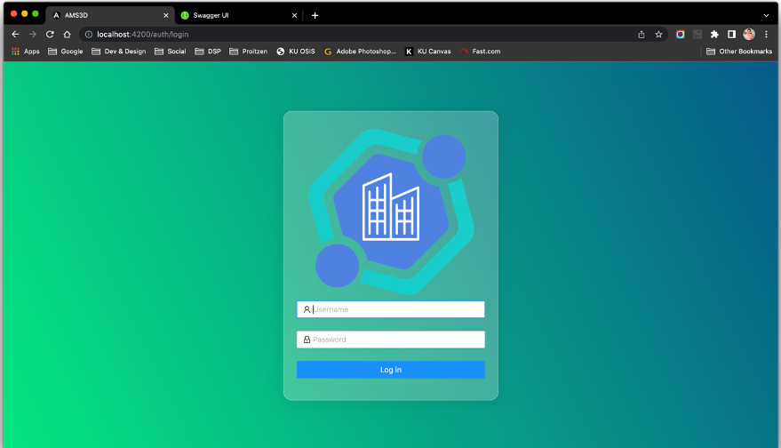
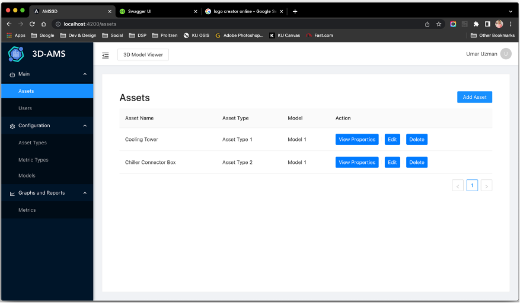
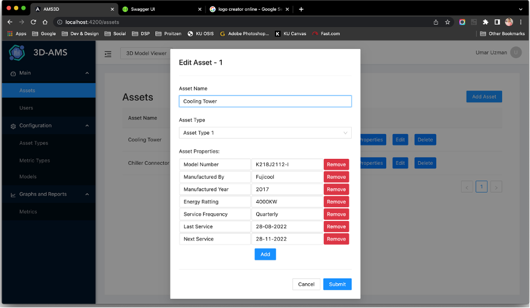
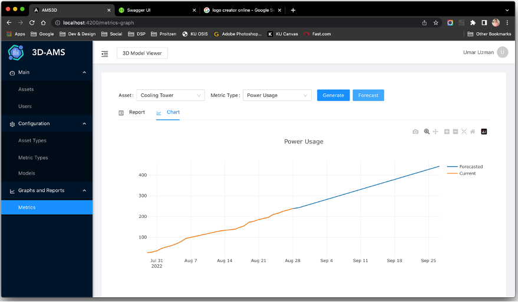
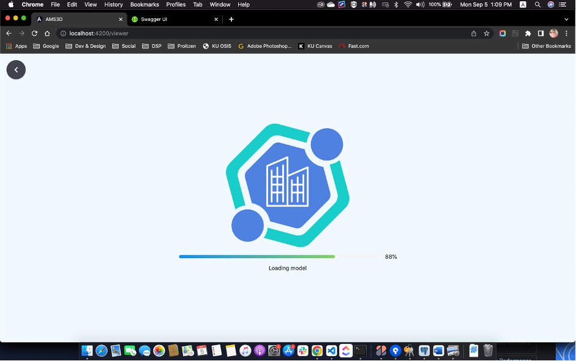
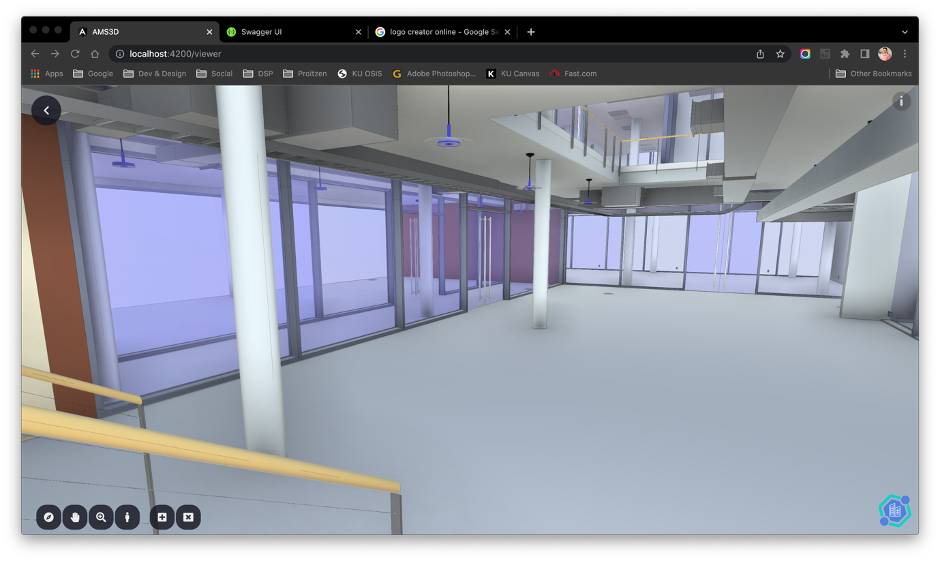
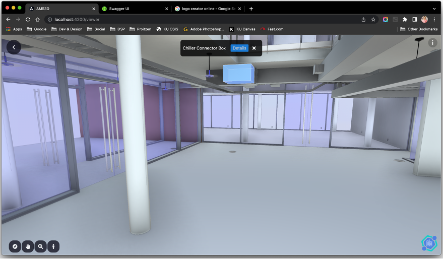
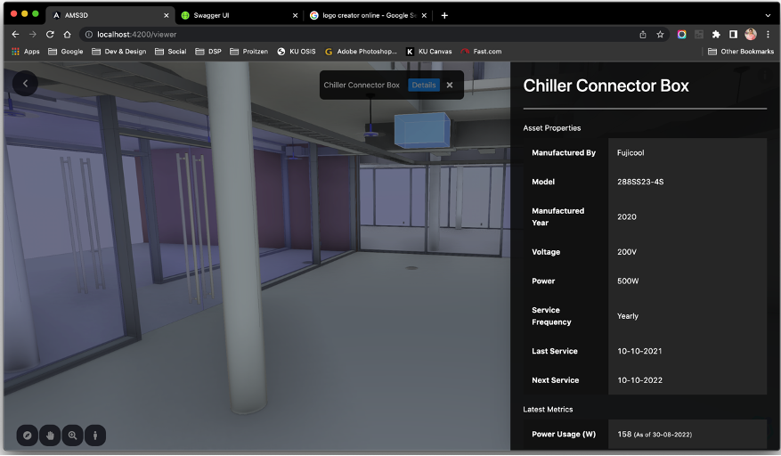

# **3D Asset Management System** by UMAR UZMAN

## Screenshots

## **[Angular Skeleton](https://github.com/umaruzman/angular-skeleton-ngantd)** by UMAR UZMAN

- This project was generated with [Angular CLI](https://github.com/angular/angular-cli) version 12.2.14.
- This project uses NG-ZORRO!
- This Skeleten was created by Umar Uzman

### Templates

- Extend Normal components to BasicComponentTemplate
- Extend Form Components to FormTemplate
- Extend Forms in Modal to ModalFormTemplate

### Layout

Use one-column-layout for main module

### Modules

Modules Folder has 2 Primary Modules

- AuthModule - It is the main module for auth related content (Login, Register)
- MainModule - It is the main module of the application where all other functionalities resides.

SharedModule exports the most commonly used modules among most components, therfore importing this component on the component that need it will provide basic support for most Ng-Zorro Feature.
